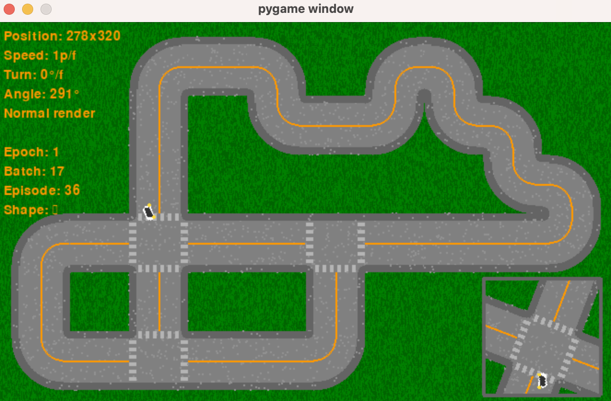

# RL Car 2d

A car that with a deep learning network that learns to drive purely from vision from a simulated camera.

This started as a practice project while reading the [spinningup.openai.com](https://spinningup.openai.com/) guide on RL from Joshua Achiam @ OpenAI, and then became a hobby/weekends experimentation. Helped me to acquire tons of intuition about RL. Learning end-to-end through making the car more intelligent. 

## Getting Started

### Prerequisites

Install the PIP dependencies from `requirements.txt`.

### Running

Use Intellij Idea run configurations to run in modes:

1. Debug (with rendering, normal environment speed);
2. Research (with rendering, fast-forward environment speed);
3. Train (no rendering, fast-forward environment speed);
4. MPS (Apples Metal Performance Shaders);

## Results

Currently, the car can drive decently around turns and even make it through crossroads (based on the yellow turn signal from the drive), although stability can be improved.

## Contact me

Reach out to me: `dmitrii.maliuga@gmail.com` or [linkedin/dmitrii-maliuga/](https://www.linkedin.com/in/dmitrii-maliuga/).
